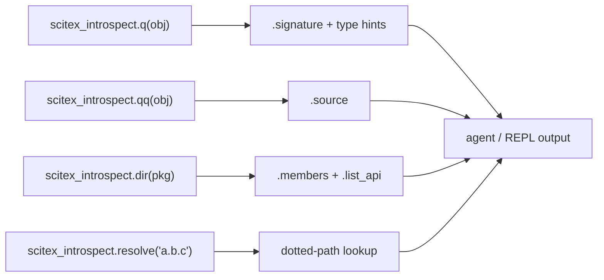
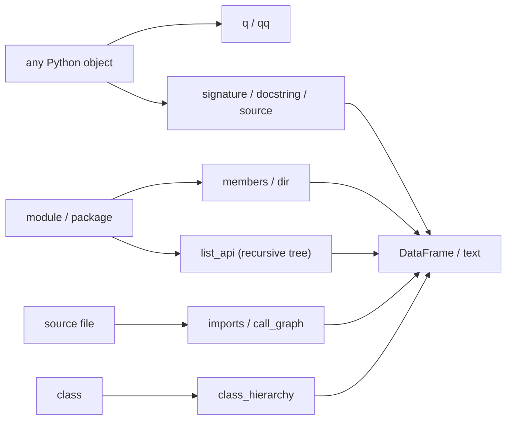

# scitex-introspect

<p align="center">
  <a href="https://scitex.ai">
    
  </a>
</p>

<p align="center"><b>IPython-style introspection for any Python package — `q`, `qq`, `dir`, signatures, source.</b></p>

<p align="center">
  <a href="https://scitex-introspect.readthedocs.io/">Full Documentation</a> · <code>uv pip install scitex-introspect[all]</code>
</p>

<!-- scitex-badges:start -->
<p align="center">
  <a href="https://pypi.org/project/scitex-introspect/"></a>
  <a href="https://pypi.org/project/scitex-introspect/"></a>
  <a href="https://scitex-introspect.readthedocs.io/en/latest/"></a>
</p>
<p align="center">
  <a href="https://github.com/scitex-ai/scitex-introspect/actions/workflows/ci.yml"></a>
  <a href="https://codecov.io/gh/ywatanabe1989/scitex-introspect"></a>
</p>
<!-- scitex-badges:end -->

---

## Quick Start

```python
import scitex_introspect as ix

ix.q(my_func)        # Signature with type hints (like `my_func?`)
ix.qq(my_func)       # Full source code (like `my_func??`)
ix.dir(my_pkg)       # List attributes/methods
```

## Demo



<p align="center"><sub><b>Figure 1.</b> Entrypoints fan out to signature, source, member, and resolver helpers.</sub></p>

```python
>>> import scitex_introspect as ix, json
>>> ix.q(json.loads)
json.loads(s, *, cls=None, object_hook=None, ...)
>>> ix.dir(json)[:3]
['JSONDecodeError', 'JSONDecoder', 'JSONEncoder']
```

## Installation

```bash
uv pip install "scitex-introspect[all]"
```

Requires Python ≥ 3.9.

<details>
<summary><b>Per-extra installs</b></summary>

<br>

| Extra | Pulls in |
|---|---|
| `mcp` | stdio MCP server for AI agents (`mcp>=1.0.0`) |
| `dev` | tests + lint + dev helpers (`pytest`, `ruff`, `scitex-dev`, …) |
| `docs` | Sphinx docs build (`sphinx`, `myst-parser`, …) |

</details>

## Architecture

```
scitex_introspect/
├── _core.py              ← q / qq IPython-style entrypoints
├── _signature.py         ← inspect.signature with type hints
├── _docstring.py         ← docstring extraction
├── _source.py            ← getsource with fallback
├── _list_api.py          ← recursive module API tree
├── _members.py           ← attribute / method enumeration
├── _imports.py           ← static import-graph extraction
├── _call_graph.py        ← AST-based caller / callee analysis
├── _class_hierarchy.py   ← MRO + base-class walk
├── _examples.py          ← scrape doctest / examples blocks
├── _resolve.py           ← dotted-path → object resolver
├── _type_hints.py        ← typing.get_type_hints helpers
├── _mcp/                 ← MCP server tools
└── _skills/              ← agent-facing skill pages
```



<p align="center"><sub><b>Figure 2.</b> Module data flow: objects, packages, files, and classes route to focused helpers.</sub></p>

Thin core over `inspect`, `importlib`, `ast`, and `typing` — hard runtime
deps are just `pandas` and `scitex-logging`.

## 2 Interfaces

<details open>
<summary><strong>Python API</strong></summary>

<br>

```python
import scitex_introspect as ix

# IPython-style shortcuts
ix.q(my_func)        # Signature with type hints
ix.qq(my_func)       # Full source code
ix.dir(my_pkg)       # List attributes/methods
ix.list_api(my_pkg)  # Recursive module API tree

# Detailed inspection
ix.signature(my_func)
ix.docstring(my_func)
ix.source(my_func)
ix.members(my_pkg)

# Static analysis
ix.imports(file_path)
ix.call_graph(my_func)
ix.class_hierarchy(MyClass)
ix.examples(my_func)
ix.resolve("scitex.io.save")
```

</details>

<details>
<summary><strong>MCP Server — for AI Agents</strong></summary>

<br>

Install with `pip install "scitex-introspect[mcp]"` and the package
exposes async handlers for IPython-style introspection over MCP — agents
can ask "what's the signature of X?" or "show me the source of Y" without
running Python themselves.

</details>

## Status

Standalone fork of `scitex.introspect`. Thin core over stdlib `inspect` /
`importlib` / `ast` / `typing` — hard runtime deps are just `pandas` and
`scitex-logging`. The umbrella package's `scitex.introspect` import path is
preserved via a `sys.modules`-alias bridge.

## Part of SciTeX

`scitex-introspect` is part of [**SciTeX**](https://scitex.ai). Install via
the umbrella with `pip install scitex[introspect]` to use as
`scitex.introspect` (Python) or `scitex introspect ...` (CLI).

>Four Freedoms for Research
>
>0. The freedom to **run** your research anywhere — your machine, your terms.
>1. The freedom to **study** how every step works — from raw data to final manuscript.
>2. The freedom to **redistribute** your workflows, not just your papers.
>3. The freedom to **modify** any module and share improvements with the community.
>
>AGPL-3.0 — because we believe research infrastructure deserves the same freedoms as the software it runs on.

## License

AGPL-3.0-only (see [LICENSE](./LICENSE)).

---

<p align="center">
  <a href="https://scitex.ai" target="_blank"></a>
</p>
